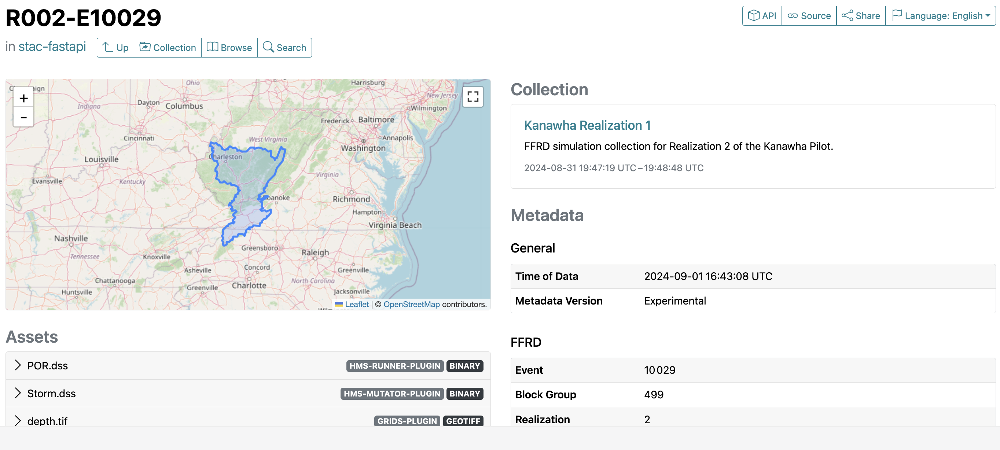
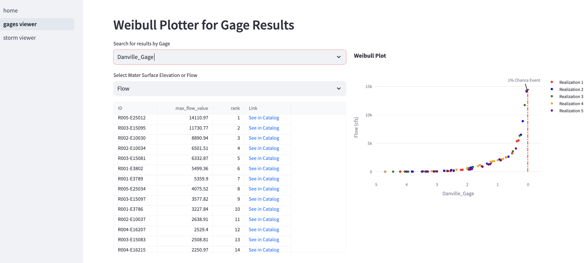
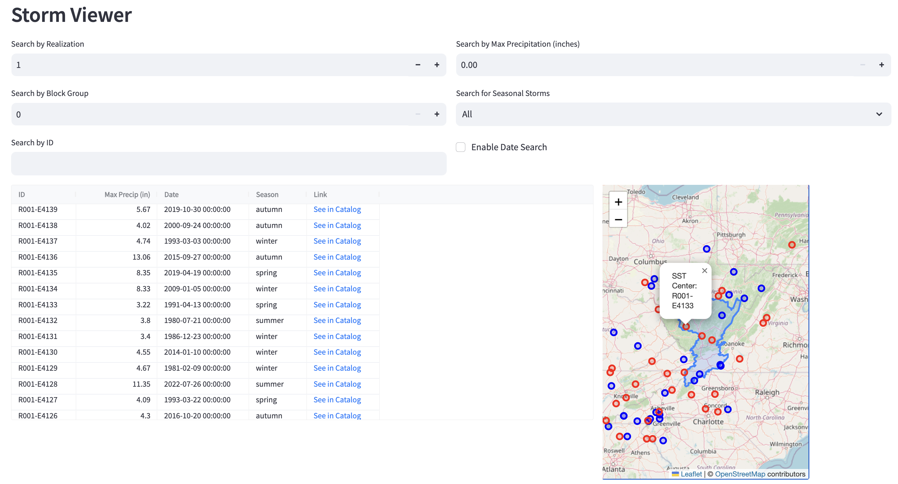

# stac-graph
Experimental repo for using stac items in graphs for linked compute. Create stac catalogs probabilistic realizations, collect data from the stac catalog, and review results.

---
STAC Items

---

Review SST Data 

---

Review Gage Results

